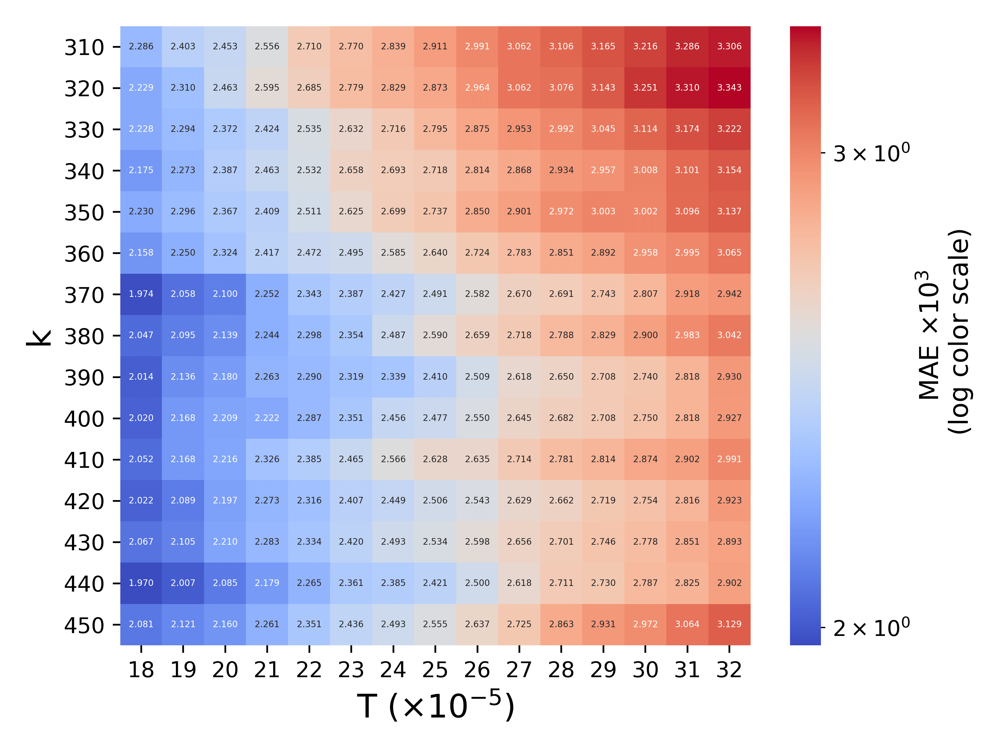

# Forecasting US/UK Foreign Exchange rate

Author: Sang Truong and Shuto Araki at DePauw University, Spring 2019

This paper evaluate the performance of Autoregressive Integrated Moving Average (ARIMA) model and Nearest Neighbor Matching (NNM) Algorithm in forecasting foreign exchange (Forex) rate. The examined data sets were GBP/USD and EUR/USD. Hyperparameters both ARIMA and NNM were optimized using exhaustive search inspired by the Box-Jenkins methodology. The result shows that the most significant determinant of a Forex rate data point is its previous lag. This paper gives an insight into Forex market and provides a simple forecasting strategy for Forex investors in the era of globalization.
